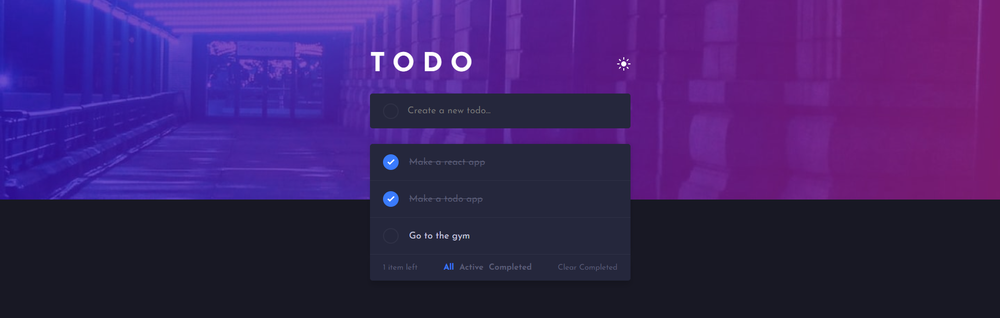
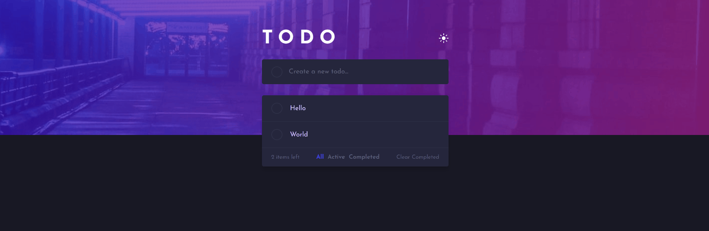
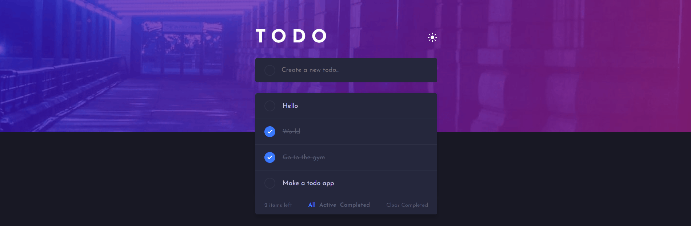
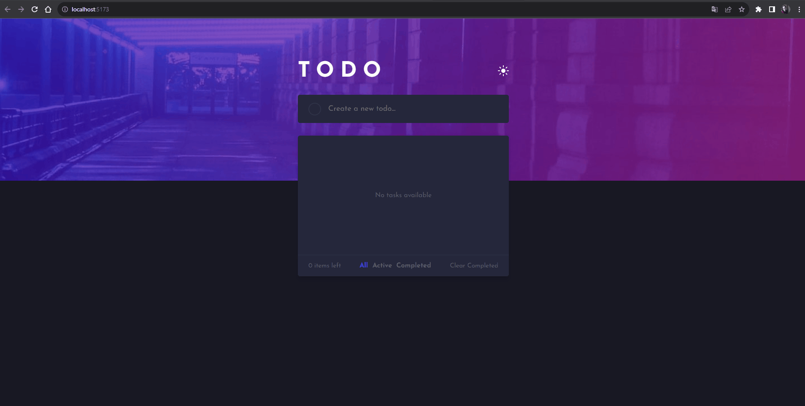

# ToDo App



## About the project

The project's about a ToDo app where the user can add tasks to be completed to a list of tasks. I also applied a feature to storage data on local storage. Which means that after the user closes his browser, the data will not be reset, consequently being stored on the local storage like the theme and the tasks done earlier.

## Table of Contents

- [About the project](#about-the-project)
- [Features](#features)
  - [Add tasks](#add-tasks)
  - [Remove task](#remove-task)
  - [Complete task](#remove-task)
  - [Filter tasks](#filter-tasks)
  - [Theme switcher](#theme-switcher)
  - [Local storage](#local-storage)
- [Built with](#built-with)
- [Run the application](#run-the-aplicattion)
- [Author](#author)
- [License](#license)

## Features

The project has the following features:

### Add tasks

The user will be able to add tasks just by typing in the input area and sending them to the list by clicking the button or pressing the enter key on the keyboard.


### Remove task

The user will be able to remove tasks just by clicking the X button.



### Complete task

The user will be able to complete a task just by clicking on the rounded button.


### Filter tasks

It's a filter that can switch between completed tasks, uncompleted tasks, and all tasks.



### Theme switcher

Here, the user will be able to switch between dark mode and light mode.

_light theme_


_dark theme_


### Local Storage

This feature stores the theme and tasks on localStorage, so when the user closes the browser or the page, the data will not reset.



## Built with

The project has been built with the following technologies:

- [React](https://react.dev/)
- [styled-components](https://styled-components.com/)
- [Vite](https://vitejs.dev/)

## Run the aplicattion

To run the application on your machine, follow the next steps:

1. Clone the repositorie

   ```sh
   git clone https://github.com/JhowBRCG/todo-app.git
   ```

2. Install the dependencies

   ```sh
   npm install
   ```

3. Initialize the server

   ```sh
   npm run dev
   ```

4. Now you can see the application in real time by putting the url http://localhost:5173/ in the browser of your choice.

## Author

Created by [@jhowbrcg](https://github.com/JhowBRCG) - fell free to contact me!

## License

This project is licensed under [MIT](https://opensource.org/licenses/MIT) license.
